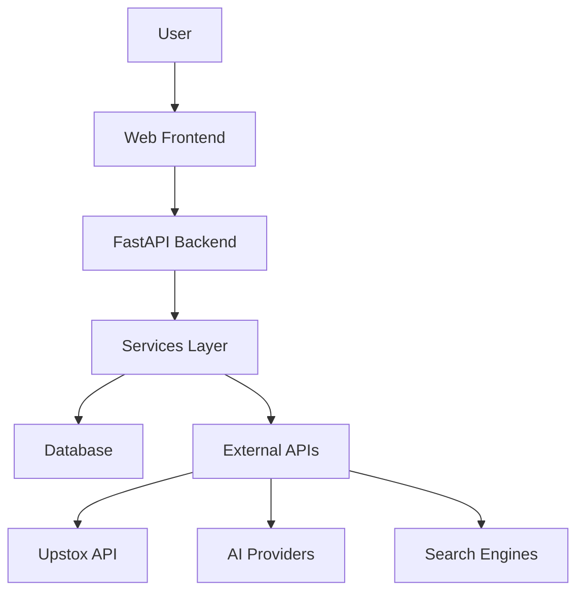
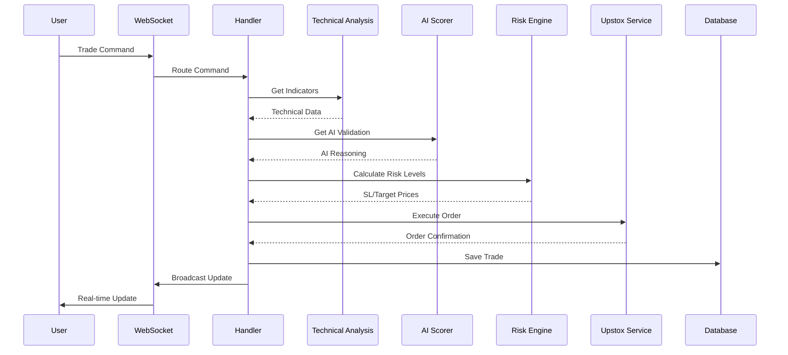
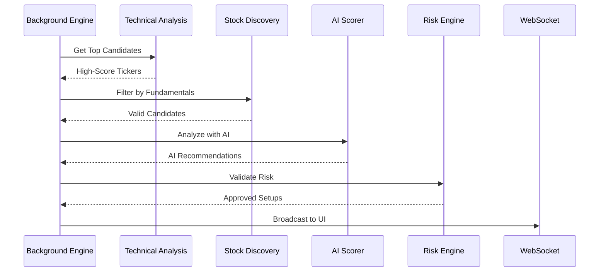

# High-Level Design Document

## Overview
This document outlines the high-level design of the SuperNova trading system, focusing on major components, their responsibilities, and interactions.

## System Context Diagram



## Core Modules

### 1. Application Entry Point (`main.py`)
**Responsibilities:**
- Initialize FastAPI application
- Setup WebSocket endpoints
- Configure REST API routes
- Manage application lifecycle (startup/shutdown)
- Handle Upstox OAuth flow
- Start background engine and streamer

**Key Classes:**
- `FastAPI` app instance
- `ConnectionManager` for WebSocket connections
- `BackgroundEngine` for scheduled tasks
- `AppState` for global state management

### 2. WebSocket Handler (`ws_handler.py`)
**Responsibilities:**
- Route incoming WebSocket messages
- Handle trading commands (scan, trade, close)
- Broadcast real-time market data
- Manage client connections

**Key Functions:**
- `handle_websocket()`: Main WebSocket connection handler
- Command processors for scan, trade, position review, exit guidance

### 3. Background Engine (`background_engine.py`)
**Responsibilities:**
- Phase-aware market monitoring
- Scheduled AI scoring during market hours
- Continuous position monitoring
- Market snapshot capturing
- Automated trade management

**Key Classes:**
- `BackgroundEngine`: Main orchestration class
- Phase detection logic (Opening 15, Mid-Session, Power Hour)
- AI call scheduling

### 4. Services Layer

#### Technical Analysis Service (`technical_analysis.py`)
**Responsibilities:**
- Calculate technical indicators (EMA, VWAP, RSI, ADX)
- Generate LZ mathematical scores
- Provide price action analysis

**Key Functions:**
- `calculate_indicators()`: Compute all technical indicators
- `get_lz_score()`: Calculate probability-based scoring

#### AI Scorer Service (`ai_scorer.py`)
**Responsibilities:**
- Generate prompts for AI models
- Process AI responses
- Enrich signals with AI reasoning
- Handle multiple AI providers (Gemini, Groq, SambaNova)

**Key Classes:**
- Prompt templates for different analysis types
- Response parsers for structured output
- Fallback mechanisms

#### Risk Engine Service (`risk_engine.py`)
**Responsibilities:**
- Calculate position sizing
- Set volatility-adjusted stop-losses and targets
- Validate risk-reward ratios
- Implement trailing stop-loss logic

**Key Functions:**
- `calculate_atr_based_levels()`: ATR-based SL/target calculation
- `validate_trade_setup()`: Risk assessment

#### Market Phase Service (`market_phase.py`)
**Responsibilities:**
- Track Indian market session states
- Determine trading permissions based on phase
- Handle holiday schedules

**Key Classes:**
- `MarketPhaseTracker`: State machine for market phases
- Holiday calendar integration

#### Upstox Service (`upstox_service.py`)
**Responsibilities:**
- Fetch historical market data
- Execute orders (buy/sell)
- Handle API authentication and rate limits

**Key Functions:**
- `get_historical_data()`: Fetch OHLC data
- `place_order()`: Execute trades

#### Upstox Streamer (`upstox_streamer.py`)
**Responsibilities:**
- Maintain WebSocket connection to Upstox
- Stream real-time market data
- Handle reconnection logic

**Key Classes:**
- `UpstoxStreamer`: Connection management
- Tick data processing and broadcasting

### 5. Data Layer (`models.py`, `database.py`)
**Responsibilities:**
- Define database schema
- Provide ORM interfaces
- Handle data persistence and retrieval

**Key Models:**
- `Trade`: Position tracking with AI metadata
- `MarketSnapshot`: Market state captures
- `AIInteraction`: API call audit trail
- `AppSettings`: User configuration

### 6. State Management (`services/state.py`)
**Responsibilities:**
- Maintain application-wide state
- Handle dashboard watch stocks
- Provide thread-safe state access

**Key Classes:**
- `AppState`: Global state container
- Dashboard stock management

## Module Interactions

### Data Flow for Trade Execution


### AI Analysis Flow


## Design Principles

### Modularity
- Each service has single responsibility
- Loose coupling through dependency injection
- Easy to test and maintain

### Reliability
- Multiple AI provider fallbacks
- Data provider redundancy (Upstox + yfinance)
- Comprehensive error handling

### Performance
- Asynchronous operations for I/O
- Efficient data structures for real-time processing
- Background processing to avoid blocking UI

### Security
- Environment-based configuration
- OAuth for external API access
- Input validation and sanitization

## Error Handling
- Service-level exception handling
- Fallback mechanisms for API failures
- User-friendly error messages via WebSocket

## Configuration
- Environment variables for sensitive data
- Database-backed settings for user preferences
- Runtime configuration updates

## Data Source Decision Matrix

This section documents the decision criteria for selecting data sources (Upstox vs yfinance) across different market data categories, including fallback mechanisms, error handling strategies, and rate limiting considerations.

### Decision Criteria: Upstox vs yfinance

| Data Type | Primary Source | Fallback Source | When to Use Primary | When to Use Fallback |
|-----------|---------------|-----------------|---------------------|---------------------|
| Indian Stock Quotes (NSE) | Upstox | yfinance | Real-time trading, during market hours | After market hours, Upstox unavailable |
| Indian Indices | Upstox + yfinance | yfinance | Real-time requirements | Extended hours, primary failure |
| Global Indices | yfinance | None | All cases | N/A |
| Commodities | yfinance | Upstox (if available) | NSE commodity trading | Primary for global commodities |
| Currency Pairs | yfinance | Upstox | NSE currency trading | Primary for USD/INR |
| VIX India | yfinance | Upstox | Primary | Fallback |
| Futures Contracts | Upstox | yfinance | Real-time futures data | Delayed data |

---

### Category-Specific Details

#### 1. Indian Stock Quotes (NSE)

| Attribute | Value |
|-----------|-------|
| **Primary Source** | Upstox API (`/market-quote/v1/ltp`) |
| **Fallback Source** | yfinance (`yfinance.Ticker`) |
| **API Endpoints** | Upstox: `https://api.upstox.com/v3/market-quote/ltp` |
| **Known Limitations** | Upstox: Rate limits (see below), market hours only; yfinance: 1-15 min delay, less reliable for live trading |

**Decision Logic:**
- Use Upstox during active market hours (09:15-15:30 IST) for real-time quotes
- Use yfinance for after-market analysis, historical data, or when Upstox API fails
- yfinance tickers use `.NS` suffix (e.g., `RELIANCE.NS`)

#### 2. Indian Indices

| Attribute | Value |
|-----------|-------|
| **Primary Source** | Upstox (Nifty 50, Bank Nifty) + yfinance (all indices) |
| **Fallback Source** | yfinance |
| **API Endpoints** | Upstox: Instrument master + quote endpoints; yfinance: `^NIFTY 50`, `^NSEBANK`, etc. |
| **Known Limitations** | Upstox: Limited index coverage; yfinance: Delayed by 1-15 minutes |

**Supported Indices:**
- Nifty 50: `^NIFTY 50` (yfinance), `NIFTY 50` (Upstox)
- Bank Nifty: `^NSEBANK` (yfinance), `BANKNIFTY` (Upstox)
- Midcap 100: `NIFTYMIDCAP 100` (yfinance)
- Smallcap 100: `NSECMSMLCAP` (yfinance)
- Sensex: `^BSESN` (yfinance)

#### 3. Global Indices

| Attribute | Value |
|-----------|-------|
| **Primary Source** | yfinance |
| **Fallback Source** | None |
| **API Endpoints** | `^GSPC` (S&P 500), `^IXIC` (Nasdaq), `^DJI` (Dow Jones), `^GDAXI` (DAX), `^FTSE` (FTSE), `^N225` (Nikkei) |
| **Known Limitations** | US market hours apply; data delayed 1-15 minutes; may not be available during non-trading hours |

#### 4. Commodities

| Attribute | Value |
|-----------|-------|
| **Primary Source** | yfinance |
| **Fallback Source** | Upstox (MCX contracts if available) |
| **API Endpoints** | yfinance: `CL=F` (Crude Oil), `GC=F` (Gold), `SI=F` (Silver); Upstox: MCX instrument codes |
| **Known Limitations** | yfinance: Commodity prices in USD; MCX trading hours differ (09:00-23:55 IST) |

#### 5. Currency Pairs

| Attribute | Value |
|-----------|-------|
| **Primary Source** | yfinance |
| **Fallback Source** | Upstox (NSE currency pairs) |
| **API Endpoints** | yfinance: `INR=X` (USD/INR); Upstox: `USDINR` instrument |
| **Known Limitations** | yfinance: May have wider spreads; limited currency pair coverage |

#### 6. VIX India

| Attribute | Value |
|-----------|-------|
| **Primary Source** | yfinance |
| **Fallback Source** | Upstox |
| **API Endpoints** | yfinance: `^INDIAVIX`; Upstox: VIX instrument code |
| **Known Limitations** | VIX calculation methodology differs between sources; not real-time |

#### 7. Futures Contracts

| Attribute | Value |
|-----------|-------|
| **Primary Source** | Upstox |
| **Fallback Source** | yfinance (delayed) |
| **API Endpoints** | Upstox: `/market-quote/v1/ltp` with instrument tokens; yfinance: Future tickers with `-F` suffix |
| **Known Limitations** | Upstox: Requires instrument master; expiry tracking needed; yfinance: Delayed, less reliable for futures |

---

### Fallback Mechanisms

#### Automatic Fallback Logic

```python
def get_quote_with_fallback(symbol: str, is_nse: bool = True) -> dict:
    """
    Attempts to fetch quote from primary source, falls back on failure.
    """
    try:
        # Try primary source (Upstox for NSE)
        if is_nse:
            return upstox_service.get_quote(symbol)
    except (UpstoxAPIError, RateLimitError, ConnectionError) as e:
        logger.warning(f"Upstox failed for {symbol}: {e}, trying yfinance")
        
    # Fallback to yfinance
    return yfinance_helper.get_quote(symbol, is_nse=is_nse)
```

#### Fallback Priority Levels

| Priority | Source | Trigger Condition |
|----------|--------|-------------------|
| 1 (Primary) | Upstox | API available, within rate limits, market hours |
| 2 (Secondary) | yfinance | Upstox unavailable, rate limited, or after hours |
| 3 (Emergency) | Cached Data | Both sources fail, return stale data with warning |

#### Implementation in Services

- **Stock Discovery** (`services/stock_discovery.py`): Uses yfinance for bulk screening, Upstox for validation
- **Technical Analysis** (`services/technical_analysis.py`): Accepts data from any source via unified interface
- **Background Engine** (`background_engine.py`): Implements fallback for AI scoring data fetch

---

### Error Handling Strategies

#### Error Categories and Handling

| Error Type | Source | Handling Strategy | Retry Policy |
|------------|--------|------------------|--------------|
| `UpstoxAuthError` | Upstox | Re-authenticate, use yfinance fallback | Immediate retry after auth |
| `RateLimitError` | Upstox | Backoff, switch to yfinance | Exponential backoff (1s, 2s, 4s, max 3 retries) |
| `ConnectionError` | Both | Switch to fallback, log error | 3 retries with 2s delay |
| `InvalidSymbolError` | Both | Mark as invalid, skip processing | No retry |
| `MarketClosedError` | Upstox | Use yfinance for extended hours data | No retry |
| `DataNotAvailableError` | yfinance | Log warning, return None | No retry |

#### Error Codes Reference

**Upstox API Errors:**
| Code | Description | Action |
|------|-------------|--------|
| 400 | Bad Request | Log error, skip symbol |
| 401 | Unauthorized | Re-authenticate token |
| 403 | Forbidden | Check API permissions |
| 429 | Rate Limited | Backoff + yfinance fallback |
| 500 | Server Error | Retry with backoff |
| 503 | Service Unavailable | Switch to yfinance |

**yfinance Errors:**
| Code/Exception | Description | Action |
|----------------|-------------|--------|
| `YFDownloadError` | Download failed | Retry, fallback to Upstox if NSE |
| `NoDataError` | No data available | Skip symbol |
| `TimeoutError` | Request timeout | Retry with longer timeout |

#### Error Handling Pattern

```python
async def fetch_market_data_with_retry(symbol: str, use_upstox: bool = True) -> dict:
    """
    Fetches market data with comprehensive error handling.
    """
    max_retries = 3
    retry_delay = 2
    
    for attempt in range(max_retries):
        try:
            if use_upstox:
                return await upstox_service.get_historical_data(symbol)
            else:
                return yfinance_helper.get_historical_data(symbol)
        except RateLimitError as e:
            if attempt < max_retries - 1:
                await asyncio.sleep(retry_delay * (2 ** attempt))
                continue
            # Fallback to yfinance on rate limit
            return yfinance_helper.get_historical_data(symbol)
        except (ConnectionError, TimeoutError) as e:
            if attempt < max_retries - 1:
                await asyncio.sleep(retry_delay)
                continue
            # Fallback to alternative source
            return yfinance_helper.get_historical_data(symbol) if use_upstox else None
        except Exception as e:
            logger.error(f"Unexpected error fetching {symbol}: {e}")
            raise
```

---

### Rate Limiting Considerations

#### Upstox Rate Limits

| Endpoint Category | Requests/Minute | Requests/Day | Notes |
|------------------|-----------------|--------------|-------|
| Market Quote (LTP) | 30 | 10,000 | Primary quote endpoint |
| Historical Data | 15 | 5,000 | OHLC data |
| Order Placement | 10 | 1,000 | Trading endpoints |
| Portfolio | 30 | 10,000 | Holdings/positions |
| WebSocket | Continuous | Unlimited | Real-time streaming |

**Rate Limit Headers:**
- `X-RateLimit-Remaining`: Remaining requests in window
- `X-RateLimit-Reset`: Unix timestamp when limit resets

#### Quota Management Strategy

```python
class QuotaManager:
    """
    Manages API quotas for Upstox and yfinance.
    """
    
    def __init__(self):
        self.upstox_remaining = 10000  # Daily limit
        self.upstox_reset_time = None
        self.yfinance_cooldown = 0
    
    async def check_quota(self, source: str) -> bool:
        """Check if quota available for source."""
        if source == "upstox":
            return self.upstox_remaining > 0
        elif source == "yfinance":
            return self.yfinance_cooldown <= 0
        return True
    
    async def consume_quota(self, source: str, count: int = 1):
        """Consume quota for source."""
        if source == "upstox":
            self.upstox_remaining -= count
        elif source == "yfinance":
            self.yfinance_cooldown = 5  # 5 second cooldown
    
    async def wait_if_needed(self, source: str):
        """Wait if quota exhausted."""
        if source == "upstox" and self.upstox_remaining <= 0:
            wait_time = self.upstox_reset_time - time.time()
            if wait_time > 0:
                await asyncio.sleep(wait_time)
        elif source == "yfinance" and self.yfinance_cooldown > 0:
            await asyncio.sleep(self.yfinance_cooldown)
```

#### Rate Limit Best Practices

1. **Batch Requests**: Use instrument master to get multiple symbols in single call
2. **Cache Responses**: Cache quote data for 5-15 seconds to reduce API calls
3. **Prioritize Active Symbols**: Apply stricter caching to less active symbols
4. **Use WebSocket**: Prefer WebSocket streaming over polling for real-time data
5. **Implement Circuit Breaker**: Temporarily disable source after repeated failures

---

### Implementation Reference

| Service | Primary Data Source | Fallback | File |
|---------|---------------------|----------|------|
| Quote Fetching | Upstox | yfinance | `services/upstox_service.py` |
| Historical Data | Upstox | yfinance | `services/upstox_service.py`, `services/yfinance_helper.py` |
| Stock Discovery | yfinance | Upstox (validation) | `services/stock_discovery.py` |
| Technical Analysis | yfinance | Cached/Static | `services/technical_analysis.py` |
| Real-time Streaming | Upstox WebSocket | None | `services/upstox_streamer.py` |
| Portfolio Data | Upstox | Cache | `services/portfolio_streamer.py` |

---

### Testing Data Sources

- **Unit Tests**: Mock both Upstox and yfinance responses
- **Integration Tests**: Use sandbox environment for Upstox, test against live yfinance
- **Error Simulation**: Test fallback behavior by simulating API failures
- **Rate Limit Testing**: Verify quota management under load

This documentation should be updated whenever new data sources are added or existing source configurations change.