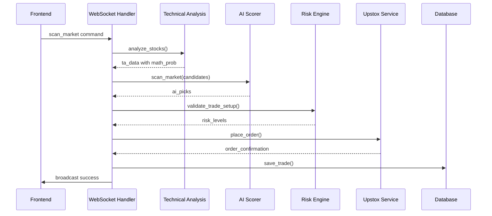
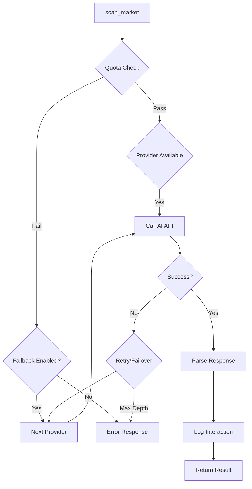

# Low-Level Design Document

## Overview
This document provides detailed design specifications for key components, including class structures, methods, algorithms, and data flows.

## Core Classes and Methods

### 1. TechnicalAnalysisService (`services/technical_analysis.py`)

#### Class Structure
```python
class TechnicalAnalysisService:
    def __init__(self):
        # No state, stateless service
    
    def fetch_ohlcv(self, ticker: str, period="30d", interval="5m", data_provider="upstox", fallback_enabled=True) -> pd.DataFrame
    def compute_indicators(self, df: pd.DataFrame) -> dict
    def analyze_stock(self, ticker: str, data_provider: str = "upstox", fallback_enabled: bool = True) -> dict
    def evaluate_math_probability(self, ta_data: dict) -> float
    def classify_signal(self, ta_data: dict) -> str
    def get_connection_status(self) -> dict
    def get_chart_payload(self, ticker: str, interval: str = "5m", params: dict = None) -> dict
    def fetch_fundamentals(self, ticker: str) -> dict
```

#### Key Methods

##### `fetch_ohlcv()`
**Algorithm:**
1. Check simulation mode for mock data generation
2. If Upstox provider and authenticated:
   - Map interval to Upstox units (minutes, hours, days)
   - Call `_upstox_svc.fetch_ohlcv()` with calculated parameters
   - Apply resampling for consistent intervals
3. Fallback to yfinance if Upstox fails or disabled:
   - Use cached data (5-minute TTL) to avoid rate limits
   - Handle MultiIndex columns from yfinance
4. Return standardized DataFrame with OHLCV columns

**Data Structures:**
- Input: ticker (str), period/intervals (str), provider settings
- Output: pandas.DataFrame with columns ['Open', 'High', 'Low', 'Close', 'Volume']

##### `compute_indicators()`
**Algorithm:**
1. Validate input DataFrame (minimum 50 rows)
2. Calculate Typical Price: `TP = (High + Low + Close) / 3`
3. Compute EMA9 and EMA21 using pandas-ta
4. Calculate RSI(14) using pandas-ta
5. Generate MACD with signal line using pandas-ta
6. Compute Bollinger Bands (20-period, 2σ) using pandas-ta
7. Calculate ADX(14) using pandas-ta
8. Compute VWAP for today's data:
   - Filter data for current trading day
   - Calculate cumulative VWAP: `vwap = Σ(tp * volume) / Σ(volume)`
9. Calculate volume surge: `current_avg_vol / 20_period_avg_vol`
10. Extract latest values into dictionary

**Data Structures:**
```python
indicators = {
    "close": float,
    "ema_9": float,
    "ema_21": float,
    "rsi_14": float,
    "macd": float,
    "macd_hist": float,
    "macd_signal": float,
    "bb_upper": float,
    "bb_lower": float,
    "bb_mid": float,
    "adx_14": float,
    "vwap": float,
    "vol_surge": float,
    "change_pct": float,
    "lorentzian": float  # From ML classifier
}
```

##### `evaluate_math_probability()`
**Algorithm:**
- Initialize score = 0.0
- **Trend Alignment (40% weight):**
  - Bullish: EMA9 > EMA21 and Close > VWAP → score += 0.4
  - Bearish: EMA9 < EMA21 and Close < VWAP → score += 0.4
  - Conflicting signals → score += 0.1
- **Momentum/ADX (20% weight):**
  - ADX > 25 → score += 0.2
  - ADX > 15 → score += 0.1
- **RSI Oscillators (20% weight):**
  - Bullish: RSI 40-70 → score += 0.2
  - Bearish: RSI 30-60 → score += 0.2
  - Overbought (RSI > 75) or Oversold (RSI < 25) → score = 0 (hard block)
- **MACD Bias (20% weight):**
  - MACD hist supports trend → score += 0.2

**Return:** score (0.0 to 1.0)

##### `classify_signal()`
**Algorithm:**
- Scoring system with weights:
  - Trend alignment: ±3 points
  - MACD momentum: ±1 point
  - ADX strength: ±1 point (if trend confirmed)
  - RSI exhaustion: -2 to +2 points (hard blocks)
  - Volume surge: ±1 point
- Thresholds:
  - ≥4: STRONG BUY
  - ≥2: BUY
  - ≤-4: STRONG SHORT SELL
  - ≤-2: SHORT SELL
  - Else: NEUTRAL

### 2. AIAdvisorService (`services/ai_scorer.py`)

#### Class Structure
```python
class AIAdvisorService:
    def __init__(self):
        self.google_client = genai.Client()
        self._provider_cooldowns = {}  # provider: cooldown_timestamp
    
    def scan_market(self, candidates: list[dict], global_context: dict, phase_ctx: dict, provider: str = "google", model_name: str = "gemini-2.0-flash", ai_fallback: bool = True) -> list[dict]
    def review_positions(self, open_trades: list[dict], global_context: dict, phase_ctx: dict, provider: str = "google", model_name: str = "llama-3.3-70b-versatile", ai_fallback: bool = True) -> dict
    def exit_guidance(self, open_trades: list[dict], global_context: dict, phase_ctx: dict, provider: str = "google", model_name: str = "gemini-3.1-pro", ai_fallback: bool = True) -> dict
    def _call_ai(self, prompt: str, prompt_type: str, provider: str, model_name: str, input_summary: str = "", ai_fallback: bool = True, _depth: int = 0) -> dict
    def _parse_json_response(self, text: str) -> dict
    def _log_interaction(self, prompt_type: str, model_used: str, input_summary: str, output: dict)
```

#### Key Methods

##### `_call_ai()` - AI Execution Engine
**Algorithm:**
1. Depth check: Prevent infinite recursion (>3 failovers)
2. Cooldown check: Skip providers cooling down from recent failures
3. Quota validation: Check daily limits via QuotaService
4. Provider routing:
   - Google: Gemini API call
   - Groq: REST API to Groq
   - SambaNova: REST API to SambaNova
5. Error handling:
   - Rate limits (429): Set 5-minute cooldown, failover
   - API errors: Short cooldown (60s), failover
   - JSON parsing: Attempt multiple extraction strategies
6. Success logging: Record to ai_interactions table

**Fallback Chain:** google → groq → sambanova → error

**Data Structures:**
```python
ai_response = [
    {
        "ticker": "STOCK.NS",
        "action": "BUY" | "SHORT SELL",
        "confidence": 70-100,
        "reasoning": "Surgical 2-line TA evidence",
        "valid_for_minutes": 10-15
    }
]
```

##### `scan_market()` - Market Scanning
**Algorithm:**
1. Filter candidates to top 8 by math probability
2. Build compact summaries (token optimization)
3. Construct prompt with market context (time, phase, Nifty, VIX)
4. Call AI with SCAN prompt type
5. Parse and validate response
6. Return up to 2 high-conviction picks

**Prompt Structure:**
- Time/phase context
- Market indices
- Stock summaries with TA data
- Strict rules (math probability >0.5, trend alignment, RSI guards)

##### `review_positions()` - Position Management
**Algorithm:**
1. Format position summaries with P&L, SL, risk advice
2. Include market context (Nifty, VIX, time to close)
3. AI prompt focuses on capital preservation
4. Return per-position advice: HOLD, TRAIL SL, BOOK 50%, EXIT

**Rules Engine:**
- Respect Risk Engine advice
- Profit taking at 1% unrealized
- Time urgency (<45 min to close)
- VIX spike detection

### 3. RiskEngine (`services/risk_engine.py`)

#### Key Methods
##### `calculate_atr_based_levels()`
**Algorithm:**
1. Calculate ATR(14) for volatility measurement
2. Stop Loss: `entry_price ± (ATR * multiplier)` (typically 1.5-2.0)
3. Target 1: `entry_price ± (risk_per_share * 1.5)` (1.5:1 R:R)
4. Target 2: `entry_price ± (risk_per_share * 3.0)` (3:1 R:R)
5. Adjust for minimum tick sizes and market rules

**Data Structures:**
```python
risk_levels = {
    "stop_loss": float,
    "target_1": float,
    "target_2": float,
    "risk_per_share": float,
    "max_loss": float,
    "position_size": int,
    "atr_value": float
}
```

### 4. MarketPhase (`services/market_phase.py`)

#### Class Structure
```python
class MarketPhaseTracker:
    def __init__(self):
        self.holidays = []  # Holiday dates
    
    def get_current_phase(self, current_time=None) -> dict
    def is_market_open(self, dt=None) -> bool
    def minutes_to_close(self, dt=None) -> int
    def load_holidays(self)
```

#### Key Algorithm
**Phase Detection:**
- Pre-market: 09:00-09:15
- Opening 15: 09:15-09:30
- Mid-session: 09:30-14:30
- Power hour: 14:30-15:00
- Closing: 15:00-15:30

**Time Calculations:**
- Use IST timezone
- Account for holidays
- Handle weekends

### 5. BackgroundEngine (`background_engine.py`)

#### Class Structure
```python
class BackgroundEngine:
    def __init__(self, state: AppState, manager: ConnectionManager):
        self.state = state
        self.manager = manager
        self.phase_tracker = MarketPhaseTracker()
    
    async def run(self):
        # Main loop
    
    async def _scan_cycle(self):
        # Market scanning logic
    
    async def _position_review_cycle(self):
        # Position monitoring
```

#### Main Loop Algorithm
```python
async def run(self):
    while True:
        phase = self.phase_tracker.get_current_phase()
        
        if phase['is_open'] and phase['phase'] in ['opening_15', 'mid_session']:
            await self._scan_cycle()
        
        if self.state.open_trades:
            await self._position_review_cycle()
        
        await asyncio.sleep(30)  # 30-second cycles
```

### 6. Database Models (`models.py`)

#### Key Models
```python
class Trade(Base):
    id: str (primary key)
    ticker: str
    action: str  # BUY/SELL
    quantity: int
    entry_price: float
    stop_loss: float
    target_1: float
    target_2: float
    exit_price: float (nullable)
    pnl: float (nullable)
    status: str  # OPEN/CLOSED
    timestamp: datetime
    # V2 fields
    phase_entered: str
    ai_reasoning: Text
    valid_until: datetime
    trailing_sl: float
    atr_at_entry: float
    risk_per_share: float
    max_loss: float
    partial_exits_json: Text
    ai_updates_json: Text

class AIInteraction(Base):
    id: int (auto)
    timestamp: datetime
    prompt_type: str  # SCAN/POSITION_REVIEW/EXIT_GUIDANCE
    model_used: str
    tokens_used: int
    input_summary: Text
    output_json: Text
    was_acted_upon: bool
    trade_date: str

class MarketSnapshot(Base):
    id: int (auto)
    timestamp: datetime
    market_phase: str
    nifty_price: float
    nifty_change_pct: float
    banknifty_price: float
    banknifty_change_pct: float
    vix: float
    advances: int
    declines: int
    sector_data_json: Text
```

## Data Flow Diagrams

### Trade Execution Flow


### AI Call Flow


## Algorithms and Calculations

### ATR-Based Risk Management
```
ATR = Average True Range over 14 periods
Risk per share = ATR * risk_multiplier (typically 1.5-2.0)
Position Size = (Total Capital * Risk Per Trade %) / Risk per share
Stop Loss = Entry ± Risk per share
Target 1 = Entry ± (Risk per share * 1.5)  # 1.5:1 R:R
Target 2 = Entry ± (Risk per share * 3.0)  # 3:1 R:R
```

### Math Probability Scoring
```
Score = 0.0 to 1.0
Trend (0.4): Bullish/Bearish alignment
Momentum (0.2): ADX > 25
RSI (0.2): Oscillator positioning (hard blocks at extremes)
MACD (0.2): Histogram bias supporting trend
```

### Volume Surge Detection
```
20_period_avg_volume = Mean(Volume[-20:])
Current_volume_surge = Current_volume / 20_period_avg_volume
Threshold = 1.5x for significance
```

## Error Handling and Resilience

### Provider Failover Chain
1. Primary provider fails → Check cooldown
2. If cooling, skip to next
3. Try next provider in chain
4. Maximum 3 failover attempts
5. Return structured error if all fail

### Data Validation
- OHLCV data integrity checks
- Indicator calculation bounds
- API response schema validation
- JSON parsing with multiple fallback strategies

### Caching Strategies
- yfinance data: 5-minute TTL
- Connection status: 30-second TTL
- ML model predictions: Per-request (no cache for freshness)

## Performance Optimizations

### Asynchronous Operations
- All I/O operations use async/await
- WebSocket broadcasting is non-blocking
- AI calls have 30-second timeouts

### Memory Management
- DataFrames limited to last 1000 candles
- Indicator calculations use vectorized pandas operations
- Garbage collection after large computations

### Token Optimization
- Compact TA summaries for AI prompts
- Structured JSON responses
- Model selection based on task complexity