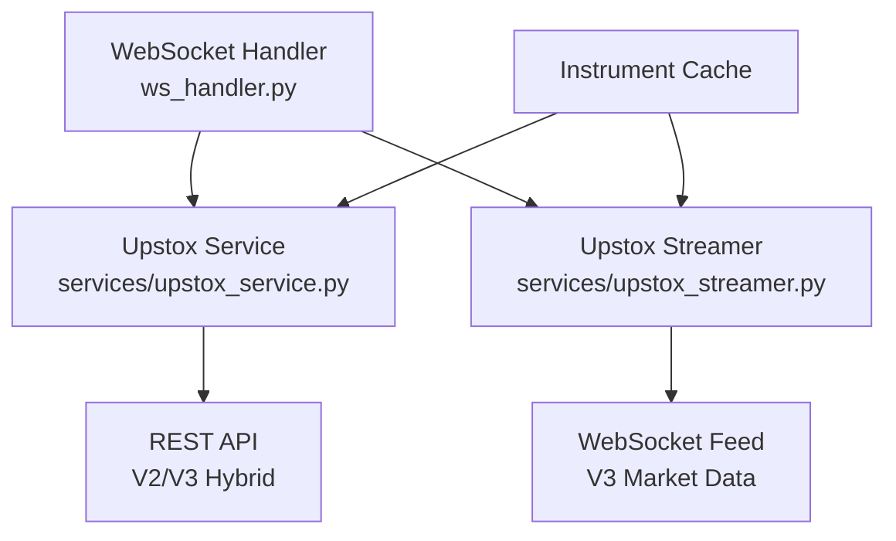

# Upstox API Compliance Fix - Implementation Plan

> **Plan Version**: 1.0  
> **Created**: 2026-03-21  
> **Target**: Production Stability & API Compliance

---

## Executive Summary

This document outlines a comprehensive plan to fix compliance issues identified in the Upstox API integration. The current implementation has several gaps compared to the official Upstox API documentation, including:

- **Test mock URL discrepancies** (V2 vs V3 endpoints)
- **Missing WebSocket unsubscribe functionality**
- **No exponential backoff in WebSocket reconnection**
- **Using full instrument download instead of search API**
- **No BSE/MCX instrument support**
- **No Portfolio Stream implementation**
- **No WebSocket event system**
- **No mode change support** (ltpc, full, option_greeks)

The fixes are organized into three phases prioritized by production impact:

| Phase | Priority | Timeline | Focus |
|-------|----------|----------|-------|
| Phase 1 | Critical | Immediate | Production stability |
| Phase 2 | High | Pre-production | API compliance & feature completeness |
| Phase 3 | Medium | Post-launch | Improvements & testing |

---

## Current Architecture Analysis

### Existing Components



### Key Files to Modify

| File | Purpose |
|------|---------|
| `services/upstox_service.py` | REST API client, instrument cache |
| `services/upstox_streamer.py` | WebSocket market data streaming |
| `tests/test_upstox_service.py` | Service unit tests |
| `tests/test_upstox_streamer.py` | Streamer unit tests |

---

## Phase 1: Critical Fixes

**Objective**: Fix issues causing production instability immediately.

### 1.1 Fix Test Mock URL Discrepancies (V2 vs V3)

**Issue**: Test mocks use V2 URL (`https://api.upstox.com/v2`) but code uses V3 endpoints.

**Current State** (`tests/test_upstox_service.py`):
```python
# Line 64 - Using BASE_URL (V2)
responses.add(responses.GET, f"{svc.BASE_URL}/historical-candle/intraday/KEY/minutes/5", ...)

# Line 100 - Using BASE_URL (V2) 
responses.add(responses.GET, f"{svc.BASE_URL}/market-quote/quotes?instrument_key=...", ...)
```

**Expected**: Tests should mock V3 endpoints as the code does.

**Files to Modify**:
- `tests/test_upstox_service.py`

**Implementation Tasks**:
- [ ] Update intraday candle test mock URL to use V3
- [ ] Update historical candle test mock URL to use V3  
- [ ] Update market quote test to use V2 (correct) - verify
- [ ] Add regex patterns for V3 URL matching where needed

**Code Changes**:
```python
# BEFORE (line 64)
responses.add(responses.GET, f"{svc.BASE_URL}/historical-candle/intraday/KEY/minutes/5", ...)

# AFTER
responses.add(responses.GET, f"{svc.V3_URL}/historical-candle/intraday/KEY/minutes/5", ...)
# OR use regex pattern
import re
url_pattern = re.compile(rf"{svc.V3_URL}/historical-candle/intraday/KEY/minutes/\d+")
responses.add(responses.GET, url_pattern, ...)
```

---

### 1.2 Add Proper WebSocket Unsubscribe Functionality

**Issue**: No unsubscribe method in `UpstoxLiveStream` class.

**Current State** (`services/upstox_streamer.py`):
```python
def subscribe(self, instrument_keys):
    """Adds instrument keys to the subscription list..."""
    # Only subscribe exists, no unsubscribe
```

**Expected**: Per Upstox API docs, need `unsubscribe(instrumentKeys)` method.

**Files to Modify**:
- `services/upstox_streamer.py`

**Implementation Tasks**:
- [ ] Add `unsubscribe()` method to `UpstoxLiveStream`
- [ ] Add `_send_unsubscription_request()` helper
- [ ] Track subscribed keys in set for management
- [ ] Handle unsubscribe on stream disconnection

**Code Implementation**:
```python
def unsubscribe(self, instrument_keys):
    """Remove instrument keys from subscription."""
    if isinstance(instrument_keys, str):
        instrument_keys = [instrument_keys]
    
    for key in instrument_keys:
        self.subscribed_keys.discard(key)
    
    if self.ws:
        asyncio.create_task(self._send_unsubscription_request(instrument_keys))

async def _send_unsubscription_request(self, keys):
    """Send unsubscribe command to WebSocket."""
    std_keys = [k.replace(":", "|") for k in keys]
    req = {
        "guid": "unsub-1",
        "method": "unsub",
        "data": {
            "instrumentKeys": std_keys
        }
    }
    await self.ws.send(json.dumps(req).encode('utf-8'))
```

---

### 1.3 Fix Reconnection with Exponential Backoff

**Issue**: WebSocket reconnection uses fixed 5-second delay, no exponential backoff.

**Current State** (`services/upstox_streamer.py` lines 158-161):
```python
except Exception as e:
    if not self.running: break
    logger.error(f"WS Outer Loop Error: {e}")
    await asyncio.sleep(5)  # Fixed delay!
```

**Expected**: Implement exponential backoff with jitter per Upstox docs.

**Files to Modify**:
- `services/upstox_streamer.py`

**Implementation Tasks**:
- [ ] Add backoff configuration constants
- [ ] Implement exponential backoff with max retries
- [ ] Add jitter to prevent thundering herd
- [ ] Log reconnection attempts

**Code Implementation**:
```python
# Configuration constants
MAX_RECONNECT_RETRIES = 5
INITIAL_BACKOFF_SECONDS = 1
MAX_BACKOFF_SECONDS = 60
BACKOFF_MULTIPLIER = 2
JITTER_FACTOR = 0.25

async def connect_and_stream(self):
    retry_count = 0
    backoff = INITIAL_BACKOFF_SECONDS
    
    while self.running:
        try:
            # ... connection logic ...
            
            # Reset on successful connection
            retry_count = 0
            backoff = INITIAL_BACKOFF_SECONDS
            
        except Exception as e:
            if not self.running: break
            
            retry_count += 1
            if retry_count > MAX_RECONNECT_RETRIES:
                logger.error(f"Max reconnection retries ({MAX_RECONNECT_RETRIES}) exceeded")
                break
            
            # Calculate backoff with jitter
            jitter = random.uniform(0, backoff * JITTER_FACTOR)
            sleep_time = min(backoff + jitter, MAX_BACKOFF_SECONDS)
            
            logger.warning(f"WS reconnecting in {sleep_time:.1f}s (attempt {retry_count}/{MAX_RECONNECT_RETRIES})")
            await asyncio.sleep(sleep_time)
            
            # Exponential increase
            backoff = min(backoff * BACKOFF_MULTIPLIER, MAX_BACKOFF_SECONDS)
```

---

## Phase 2: High Priority

**Objective**: Achieve full API compliance before production deployment.

### 2.1 Implement Instrument Search API Usage

**Issue**: Currently downloads full NSE JSON file (~2MB) instead of using search API.

**Current State** (`services/upstox_service.py` line 188):
```python
url = "https://assets.upstox.com/market-quote/instruments/exchange/NSE.json.gz"
# Downloads entire instrument list on every cache miss
```

**Expected**: Use Instrument Search API (`/v2/instruments/search`) for targeted lookups.

**Files to Modify**:
- `services/upstox_service.py`

**Implementation Tasks**:
- [ ] Add `search_instruments()` method to `UpstoxService`
- [ ] Modify `get_instrument_key()` to use search API as primary
- [ ] Keep full download as fallback for bulk operations
- [ ] Implement caching for search results

**Code Implementation**:
```python
@rate_limit_handling
def search_instruments(self, query: str, exchanges: str = "NSE", 
                       segments: str = None, instrument_types: str = None,
                       expiry: str = None, page: int = 1, records: int = 10) -> dict | None:
    """
    Search instruments using Upstox Instrument Search API.
    Endpoint: GET https://api.upstox.com/v2/instruments/search
    """
    if not self.is_authenticated:
        return None
    
    params = {
        "query": query[:50],  # Max 50 chars
        "page_number": page,
        "records": min(records, 30)  # Max 30
    }
    
    if exchanges:
        params["exchanges"] = exchanges
    if segments:
        params["segments"] = segments
    if instrument_types:
        params["instrument_types"] = instrument_types
    if expiry:
        params["expiry"] = expiry
    
    url = f"{self.BASE_URL}/instruments/search"
    
    try:
        resp = requests.get(url, headers=self._headers(), params=params, timeout=5)
        if resp.status_code == 200:
            return resp.json()
        else:
            self._handle_api_error(resp, "instrument_search")
    except Exception as e:
        logger.error(f"Upstox instrument search exception: {e}")
    
    return None

def get_instrument_key(self, ticker: str) -> str | None:
    """Resolve ticker to Upstox key - now uses search API first."""
    if not ticker:
        return None
    
    # Already a key
    if "|" in ticker:
        return ticker
    
    # Try search API first (more efficient)
    result = self.search_instruments(query=ticker, exchanges="NSE", records=5)
    if result and result.get("data"):
        for instrument in result["data"]:
            if instrument.get("trading_symbol", "").upper() == ticker.upper():
                return instrument.get("instrument_key")
    
    # Fallback to cache
    _load_instrument_cache()
    return _instrument_cache.get(ticker.upper())
```

---

### 2.2 Add BSE/MCX Instrument Support

**Issue**: Only NSE instruments are loaded; BSE and MCX not supported.

**Current State**: Only NSE JSON is downloaded (line 188).

**Expected**: Support all exchanges per Upstox documentation.

**Files to Modify**:
- `services/upstox_service.py`

**Implementation Tasks**:
- [ ] Add exchange configuration options
- [ ] Load BSE instruments (`BSE.json.gz`)
- [ ] Load MCX instruments (`MCX.json.gz`)
- [ ] Update cache key generation for multi-exchange

**Code Changes**:
```python
# New configuration
SUPPORTED_EXCHANGES = ["NSE", "BSE", "MCX"]
EXCHANGE_URLS = {
    "NSE": "https://assets.upstox.com/market-quote/instruments/exchange/NSE.json.gz",
    "BSE": "https://assets.upstox.com/market-quote/instruments/exchange/BSE.json.gz",
    "MCX": "https://assets.upstox.com/market-quote/instruments/exchange/MCX.json.gz"
}

def _load_instrument_cache(self, exchanges: list = None) -> None:
    """Download and cache instruments for specified exchanges."""
    global _instrument_cache, _reverse_instrument_cache, _last_cache_load
    
    exchanges = exchanges or ["NSE"]  # Default to NSE only
    
    for exchange in exchanges:
        if exchange not in EXCHANGE_URLS:
            continue
            
        url = EXCHANGE_URLS[exchange]
        # ... existing loading logic ...
```

---

### 2.3 Add Portfolio Stream for Real-Time Order Updates

**Issue**: No Portfolio Stream implementation for order/position updates.

**Expected**: Per Upstox docs, need `PortfolioDataStreamer` for:
- Order updates
- Position updates
- Holding updates
- GTT order updates

**Files to Create**:
- `services/portfolio_streamer.py` (new file)

**Implementation Tasks**:
- [ ] Create `PortfolioDataStreamer` class
- [ ] Implement WebSocket connection for portfolio feed
- [ ] Add event handlers for order/position updates
- [ ] Integrate with existing state management

**Code Implementation**:
```python
# services/portfolio_streamer.py

class PortfolioStreamer:
    """
    Portfolio Stream for real-time order/position updates.
    Documentation: https://upstox.com/developer/api-documentation/websocket
    """
    
    def __init__(self, callback=None, order_update=True, position_update=False, 
                 holding_update=False, gtt_update=False):
        self.callback = callback
        self.order_update = order_update
        self.position_update = position_update
        self.holding_update = holding_update
        self.gtt_update = gtt_update
        self.ws = None
        self.running = True
        self._reconnect_count = 0
    
    def _get_authorized_ws_url(self):
        """Fetch authorized portfolio WebSocket URL."""
        url = "https://api.upstox.com/v3/feed/portfolio/authorize"
        # ... implementation ...
    
    async def connect_and_stream(self):
        """Connect to portfolio WebSocket and stream updates."""
        while self.running:
            try:
                ws_url = self._get_authorized_ws_url()
                if not ws_url:
                    logger.warning("No portfolio WS URL, sleeping...")
                    await asyncio.sleep(60)
                    continue
                
                async with websockets.connect(ws_url) as websocket:
                    self.ws = websocket
                    logger.info("Connected to Upstox Portfolio Stream")
                    
                    # Send subscription for requested update types
                    await self._send_subscribe()
                    
                    while self.running:
                        message = await websocket.recv()
                        await self._handle_message(message)
                        
            except Exception as e:
                if not self.running:
                    break
                logger.error(f"Portfolio stream error: {e}")
                await asyncio.sleep(5)
    
    async def _send_subscribe(self):
        """Subscribe to portfolio update types."""
        req = {
            "guid": "portfolio-sub-1",
            "method": "sub",
            "data": {
                "orderUpdate": self.order_update,
                "positionUpdate": self.position_update,
                "holdingUpdate": self.holding_update,
                "gttUpdate": self.gtt_update
            }
        }
        await self.ws.send(json.dumps(req).encode('utf-8'))
    
    async def _handle_message(self, message):
        """Process incoming portfolio messages."""
        try:
            data = json.loads(message)
            if self.callback:
                await self.callback(data)
        except Exception as e:
            logger.error(f"Portfolio message parse error: {e}")
    
    def stop(self):
        """Stop the portfolio streamer."""
        self.running = False
        if self.ws:
            asyncio.create_task(self.ws.close())
```

---

### 2.4 Add WebSocket Event System

**Issue**: No event handlers for WebSocket connection lifecycle.

**Expected**: Per Upstox SDK, need events:
- `on("open")` - Connection established
- `on("close")` - Connection closed
- `on("message")` - Market updates
- `on("error")` - Error occurred
- `on("reconnecting")` - Reconnect attempt
- `on("autoReconnectStopped")` - Max retries reached

**Files to Modify**:
- `services/upstox_streamer.py`

**Implementation Tasks**:
- [ ] Add event handler dictionary
- [ ] Add `on()` and `off()` methods
- [ ] Emit events at appropriate times
- [ ] Document event types

**Code Implementation**:
```python
class UpstoxLiveStream:
    def __init__(self, callback):
        self.callback = callback
        self.upstox_service = UpstoxService()
        self.ws = None
        self.running = True
        self.subscribed_keys = set()
        
        # Event handlers
        self._event_handlers = {
            "open": [],
            "close": [],
            "message": [],
            "error": [],
            "reconnecting": [],
            "autoReconnectStopped": []
        }
    
    def on(self, event: str, handler: callable):
        """Register event handler."""
        if event in self._event_handlers:
            self._event_handlers[event].append(handler)
    
    def off(self, event: str, handler: callable):
        """Unregister event handler."""
        if event in self._event_handlers:
            self._event_handlers[event] = [h for h in self._event_handlers[event] if h != handler]
    
    def _emit(self, event: str, *args, **kwargs):
        """Emit event to all handlers."""
        for handler in self._event_handlers.get(event, []):
            try:
                handler(*args, **kwargs)
            except Exception as e:
                logger.error(f"Event handler error for {event}: {e}")
    
    # In connect_and_stream:
    async def connect_and_stream(self):
        # ... connection established ...
        self._emit("open")
        
        # ... on disconnect ...
        self._emit("close")
        
        # ... on error ...
        self._emit("error", error)
        
        # ... on reconnecting ...
        self._emit("reconnecting", attempt_number)
```

---

## Phase 3: Medium Priority

**Objective**: Post-launch improvements for feature completeness.

### 3.1 Add Mode Change Support

**Issue**: Subscribe hardcodes mode to "full"; no support for ltpc, option_greeks.

**Current State** (`services/upstox_streamer.py` line 80):
```python
req = {
    "method": "sub",
    "data": {
        "mode": "full",  # Hardcoded!
        "instrumentKeys": std_keys
    }
}
```

**Expected**: Support all modes per Upstox documentation:
- `ltpc` - Last trade price, time, quantity, previous close
- `full` - ltpc + D5 depth + candle data
- `option_greeks` - Only option greeks
- `full_d30` - Full + 30 market level quotes

**Files to Modify**:
- `services/upstox_streamer.py`

**Implementation Tasks**:
- [ ] Add mode parameter to subscribe method
- [ ] Add `changeMode()` method for runtime changes
- [ ] Update subscription requests to include mode

**Code Changes**:
```python
# Updated subscribe method
def subscribe(self, instrument_keys, mode: str = "full"):
    """
    Subscribe to instrument updates.
    
    Args:
        instrument_keys: Single key or list of instrument keys
        mode: Subscription mode - "ltpc", "full", "option_greeks", "full_d30"
    """
    valid_modes = ["ltpc", "full", "option_greeks", "full_d30"]
    if mode not in valid_modes:
        logger.warning(f"Invalid mode {mode}, defaulting to 'full'")
        mode = "full"
    
    self._current_mode = mode
    
    # ... rest of subscribe logic ...

async def _send_subscription_request(self, keys, mode: str = None):
    mode = mode or getattr(self, '_current_mode', 'full')
    req = {
        "guid": "sub-1",
        "method": "sub",
        "data": {
            "mode": mode,
            "instrumentKeys": std_keys
        }
    }

def change_mode(self, instrument_keys, new_mode: str):
    """Change mode for already-subscribed instruments."""
    if self.ws:
        asyncio.create_task(self._send_mode_change(instrument_keys, new_mode))

async def _send_mode_change(self, keys, new_mode):
    req = {
        "guid": "mode-change-1",
        "method": "changeMode",
        "data": {
            "mode": new_mode,
            "instrumentKeys": keys
        }
    }
    await self.ws.send(json.dumps(req).encode('utf-8'))
```

---

### 3.2 Enhance Error Logging

**Issue**: Limited error context in API calls and WebSocket operations.

**Implementation Tasks**:
- [ ] Add request/response logging for debugging
- [ ] Include correlation IDs in logs
- [ ] Add structured error payloads
- [ ] Create error categorization

---

### 3.3 Add Integration Tests with Sandbox

**Issue**: No integration tests against Upstox sandbox environment.

**Implementation Tasks**:
- [ ] Create `tests/integration/test_upstox_sandbox.py`
- [ ] Add pytest fixtures for sandbox credentials
- [ ] Test all API endpoints against sandbox
- [ ] Test WebSocket connections
- [ ] Add CI/CD integration test stage

---

## Detailed Implementation Checklist

### Phase 1 Tasks

| # | Task | File | Status |
|---|------|------|--------|
| 1.1.1 | Update intraday candle test to V3 URL | tests/test_upstox_service.py | [ ] |
| 1.1.2 | Update historical candle test to V3 URL | tests/test_upstox_service.py | [ ] |
| 1.1.3 | Add regex URL patterns for dynamic endpoints | tests/test_upstox_service.py | [ ] |
| 1.2.1 | Add unsubscribe() method | services/upstox_streamer.py | [ ] |
| 1.2.2 | Add _send_unsubscription_request() helper | services/upstox_streamer.py | [ ] |
| 1.2.3 | Update subscribed_keys tracking | services/upstox_streamer.py | [ ] |
| 1.3.1 | Add backoff configuration constants | services/upstox_streamer.py | [ ] |
| 1.3.2 | Implement exponential backoff logic | services/upstox_streamer.py | [ ] |
| 1.3.3 | Add jitter to prevent thundering herd | services/upstox_streamer.py | [ ] |
| 1.3.4 | Add reconnection logging | services/upstox_streamer.py | [ ] |

### Phase 2 Tasks

| # | Task | File | Status |
|---|------|------|--------|
| 2.1.1 | Add search_instruments() method | services/upstox_service.py | [ ] |
| 2.1.2 | Update get_instrument_key() to use search | services/upstox_service.py | [ ] |
| 2.1.3 | Add search result caching | services/upstox_service.py | [ ] |
| 2.2.1 | Add exchange URL configuration | services/upstox_service.py | [ ] |
| 2.2.2 | Update _load_instrument_cache for multi-exchange | services/upstox_service.py | [ ] |
| 2.2.3 | Add BSE instrument loading | services/upstox_service.py | [ ] |
| 2.2.4 | Add MCX instrument loading | services/upstox_service.py | [ ] |
| 2.3.1 | Create portfolio_streamer.py | services/portfolio_streamer.py | [ ] |
| 2.3.2 | Implement PortfolioDataStreamer class | services/portfolio_streamer.py | [ ] |
| 2.3.3 | Add order update handling | services/portfolio_streamer.py | [ ] |
| 2.3.4 | Add position update handling | services/portfolio_streamer.py | [ ] |
| 2.4.1 | Add event handler dictionary | services/upstox_streamer.py | [ ] |
| 2.4.2 | Add on()/off() methods | services/upstox_streamer.py | [ ] |
| 2.4.3 | Emit events in connection lifecycle | services/upstox_streamer.py | [ ] |

### Phase 3 Tasks

| # | Task | File | Status |
|---|------|------|--------|
| 3.1.1 | Add mode parameter to subscribe() | services/upstox_streamer.py | [ ] |
| 3.1.2 | Add change_mode() method | services/upstox_streamer.py | [ ] |
| 3.1.3 | Implement _send_mode_change() | services/upstox_streamer.py | [ ] |
| 3.2.1 | Add request/response logging | services/upstox_service.py | [ ] |
| 3.2.2 | Add structured error payloads | services/upstox_service.py | [ ] |
| 3.3.1 | Create sandbox test fixtures | tests/conftest.py | [ ] |
| 3.3.2 | Add integration tests | tests/integration/ | [ ] |

---

## Testing Strategy

### Unit Tests

All Phase 1 and 2 fixes should include unit tests:

```python
# Example test structure
def test_unsubscribe_removes_keys():
    """Test unsubscribe removes keys from tracking."""
    streamer = UpstoxLiveStream(callback)
    streamer.subscribed_keys = {"KEY1", "KEY2", "KEY3"}
    streamer.unsubscribe("KEY1")
    assert "KEY1" not in streamer.subscribed_keys
    assert "KEY2" in streamer.subscribed_keys

def test_exponential_backoff_increases():
    """Test backoff increases exponentially."""
    backoff = 1
    for i in range(5):
        assert backoff == 2 ** i
        backoff = min(backoff * 2, 60)
```

### Integration Tests

For sandbox environment:

```python
@pytest.mark.integration
@pytest.mark.skipif(not os.getenv("UPSTOX_SANDBOX_TOKEN"), 
                    reason="Sandbox token required")
async def test_subscribe_and_unsubscribe():
    """Integration test for subscribe/unsubscribe flow."""
    streamer = UpstoxLiveStream(callback)
    streamer.subscribe("NSE_INDEX|Nifty 50")
    # Verify subscription
    # ... 
    streamer.unsubscribe("NSE_INDEX|Nifty 50")
    # Verify unsubscription
```

### Test Coverage Targets

| Component | Target Coverage |
|-----------|-----------------|
| upstox_service.py | > 80% |
| upstox_streamer.py | > 75% |
| portfolio_streamer.py | > 70% |

---

## Risk Mitigation

| Risk | Impact | Mitigation |
|------|--------|------------|
| Rate limiting during instrument search | Medium | Cache search results, use exponential backoff |
| WebSocket disconnects in production | High | Implement exponential backoff with max retries |
| Instrument cache staleness | Medium | Implement TTL-based refresh |
| Sandbox API availability | Low | Add fallback to production for critical tests |

---

## Dependencies

### Required Packages

```txt
# Already in requirements.txt
requests>=2.28.0
websockets>=10.0.0

# No new packages required
```

### External APIs

| API | Endpoint | Purpose |
|-----|----------|---------|
| Upstox V2 | api.upstox.com/v2 | Instrument search, profile |
| Upstox V3 | api.upstox.com/v3 | Historical data, market quotes |
| Upstox WS | api.upstox.com/v3/feed | Market data WebSocket |
| Upstox Portfolio WS | api.upstox.com/v3/feed/portfolio | Portfolio stream |

---

## Success Criteria

After implementation, the system should:

1. ✅ All unit tests pass with correct V3 endpoint mocks
2. ✅ WebSocket can subscribe AND unsubscribe from instruments
3. ✅ Reconnection uses exponential backoff (1s → 2s → 4s → 8s → 16s → 32s → 60s max)
4. ✅ Instrument search uses API instead of full download
5. ✅ Support for BSE and MCX exchanges
6. ✅ Portfolio stream receives real-time order updates
7. ✅ Event system allows custom handlers for connection lifecycle
8. ✅ Subscribe can specify mode (ltpc, full, option_greeks, full_d30)

---

## Appendix: API Reference

### Upstox API Documentation Links

- [Instrument Search API](https://upstox.com/developer/api-documentation/instrument-search)
- [Historical Data API](https://upstox.com/developer/api-documentation/historical-data)
- [WebSocket API](https://upstox.com/developer/api-documentation/websocket)
- [Market Data Feed V3](https://upstox.com/developer/api-documentation/market-data-feed-v3)
- [Portfolio Stream](https://upstox.com/developer/api-documentation/portfolio-stream)

### Current vs Expected URLs

| Operation | Current URL | Correct URL |
|-----------|-------------|-------------|
| Intraday candles | V2 BASE_URL | V3 URL |
| Historical candles | V2 BASE_URL | V3 URL (equities), V2 (indices) |
| Market quote | V2 BASE_URL | V2 (correct) |
| Instrument search | N/A (uses JSON) | V2 `/instruments/search` |
| Market data WS | V3 Feed | V3 Feed (correct) |
| Portfolio WS | N/A | V3 Portfolio Feed |

---

*End of Implementation Plan*
